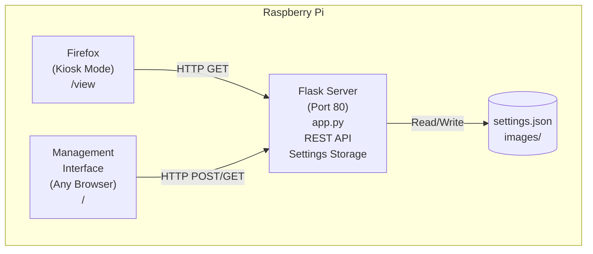
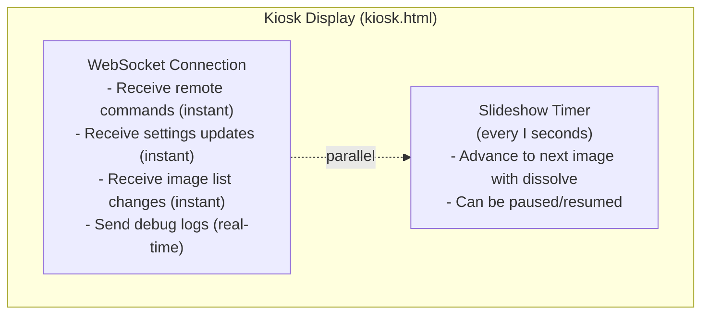
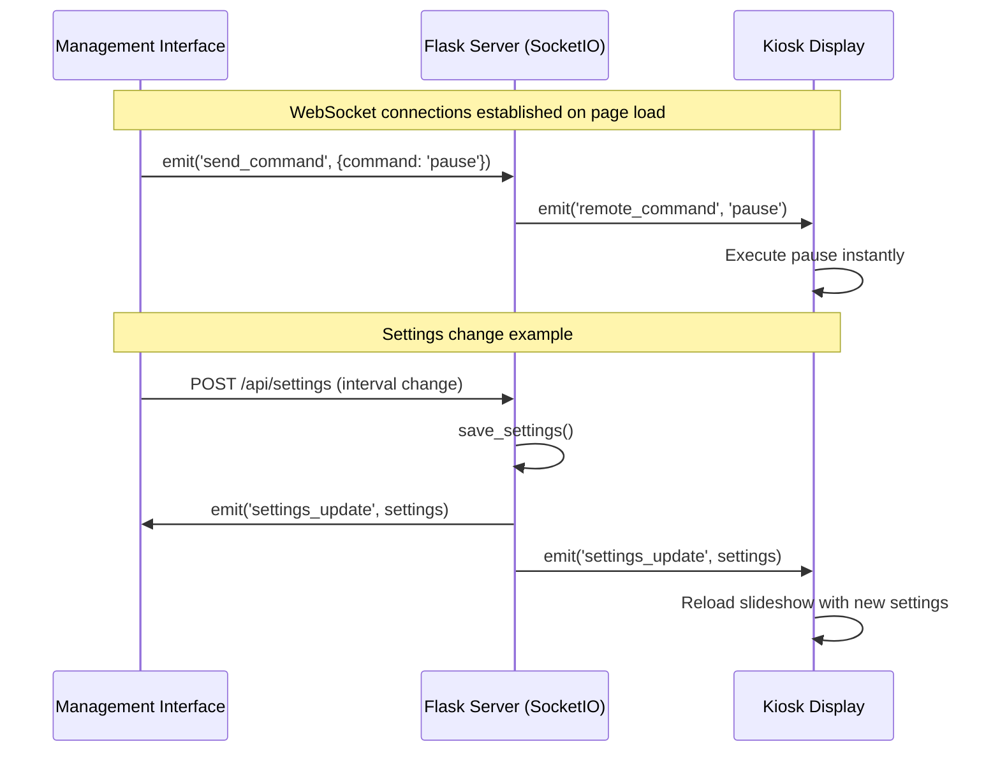
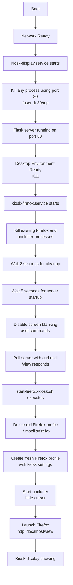

# Architecture Documentation

## Overview

The Art Kiosk is a web-based image display system designed for Raspberry Pi with a portrait monitor (2560x2880). It consists of a Flask backend server, multiple HTML frontends unified through a single-page app navigation system (management, upload, search, extra images, and display), and system integration components for autostart.

## System Architecture



## Components

### 1. Backend (app.py)

**Role**: Flask web server providing REST API and serving HTML templates.

**Key Responsibilities**:
- Image management (upload, delete, list)
- Image crop data storage and retrieval
- Settings persistence (JSON file storage)
- Theme and atmosphere management
- Remote control command queue
- Debug logging
- Image filtering by enabled state, active theme, and active atmosphere
- Randomization with consistent seeding via shuffle_id
- Auto-preview newly uploaded images on kiosk display

**Technology Stack**:
- Python 3.7+
- Flask 3.0.0
- Werkzeug 3.0.1
- Flask-SocketIO 5.3.6
- python-socketio 5.11.1
- Socket.IO JavaScript Client 4.7.2
- Cropper.js 1.6.1 (JavaScript image cropping library)

### 2. Frontend - Display (kiosk.html)

**Role**: Fullscreen slideshow display optimized for the kiosk monitor.

**Key Features**:
- Automatic slideshow with configurable interval
- Image cropping with automatic scaling to fill display
- Dissolve transitions for automatic playback
- Instant transitions for manual controls (next/prev/jump)
- Smart reload algorithm with shuffle_id detection
- Randomized image ordering that changes with theme/atmosphere switches
- Real-time WebSocket communication for remote control
- Keyboard controls
- Debug logging to server via WebSocket

**Update Mechanism**:



### 3. Frontend - Management Pages (Single-Page App)

**Role**: Web interfaces for configuring, uploading, searching, and managing kiosk content.

**Design**: Professional dark theme with black background (#000000), dark containers (#1a1a1a), white text, and color-coded badges (purple for atmospheres, blue for themes). Unified navigation menu across all pages.

**Navigation Menu**:
- **Manage** - Main management interface (active page highlighted with blue underline)
- **Upload** - File upload interface
- **Search Art** - Museum collection search
- **Extra Images** - Downloaded images management
- **Debug** - Real-time debug console
- **View Kiosk Display** - Link to kiosk view (green, right-aligned)

**Pages**:

**A. Manage (manage.html)** - Main management interface
1. **Remote Control** - Control buttons with LED indicators
2. **Atmospheres** - Create, delete, select active atmosphere, assign themes to atmospheres (purple badges)
3. **Themes** - Create, delete, select active theme (includes permanent "All Images" and "Extras" themes, blue badges)
4. **Current Images** - Grid of thumbnails with controls (filtered by active atmosphere or theme, randomized order)
   - Messages stream in real-time via WebSocket

**B. Upload (upload.html)** - Dedicated upload interface
- Drag-and-drop file upload area
- Multi-file upload support
- Auto-preview on kiosk after upload
- UUID-based automatic naming

**C. Search Art (search.html)** - Museum collection search
- Search multiple museum APIs (Cleveland, Rijksmuseum, Wikimedia, etc.)
- Portrait aspect ratio filtering
- Download to extra images folder
- Real-time search progress

**D. Extra Images (extra-images.html)** - Downloaded images management
- Review art search results
- Import to main storage (single or bulk)
- Delete unwanted images
- Preview before importing

**E. Debug (debug.html)** - Real-time debug console
- Real-time logs from kiosk display streamed via WebSocket
- Copy logs to clipboard with 📋 Clip button (HTTP-compatible fallback)
- Clear accumulated messages with Clear Console button
- Separate page accessible from navigation menu

**Interactive Features**:
- **Unified Navigation** - All pages share the same navigation menu for seamless browsing
- **No New Tabs** - All internal links navigate within the same window
- Click image thumbnail to jump to that image
- Crop images using Cropper.js modal interface
- Enable/disable images with checkboxes
- Assign images to themes via dropdown
- Assign themes to atmospheres via modal
- Remove images from themes by clicking theme tags
- LED indicators show play/pause state
- Cropped thumbnails preview actual kiosk display
- Mutual exclusivity: selecting atmosphere deselects theme, and vice versa
- Auto-preview: newly uploaded images automatically display on kiosk
- Real-time debug console with clipboard copy support

## Data Model

### Settings (settings.json)

```json
{
  "interval": 3600,
  "check_interval": 2,
  "enabled_images": {
    "photo1.jpg": true,
    "photo2.jpg": false
  },
  "dissolve_enabled": true,
  "themes": {
    "All Images": {
      "name": "All Images",
      "created": 1699752000,
      "interval": 3600
    },
    "Nature": {
      "name": "Nature",
      "created": 1699752100,
      "interval": 3600
    },
    "Urban": {
      "name": "Urban",
      "created": 1699752200,
      "interval": 1800
    }
  },
  "image_themes": {
    "photo1.jpg": ["Nature"],
    "photo2.jpg": ["Nature", "Urban"],
    "photo3.jpg": ["Urban"]
  },
  "active_theme": "All Images",
  "atmospheres": {
    "Evening": {
      "name": "Evening",
      "created": 1699752300,
      "interval": 1800
    },
    "Morning": {
      "name": "Morning",
      "created": 1699752400,
      "interval": 3600
    }
  },
  "atmosphere_themes": {
    "Evening": ["Nature", "Urban"],
    "Morning": ["Nature"]
  },
  "active_atmosphere": null,
  "day_scheduling_enabled": false,
  "day_times": {
    "1": {"start_hour": 6, "atmospheres": ["Morning"]},
    "2": {"start_hour": 8, "atmospheres": []},
    "3": {"start_hour": 10, "atmospheres": []},
    "4": {"start_hour": 12, "atmospheres": ["Evening"]},
    "5": {"start_hour": 14, "atmospheres": []},
    "6": {"start_hour": 16, "atmospheres": []}
  },
  "shuffle_id": 0.123456789,
  "image_crops": {
    "photo1.jpg": {
      "x": 0,
      "y": 0,
      "width": 1690,
      "height": 1885,
      "imageWidth": 1690,
      "imageHeight": 3000
    }
  }
}
```

**Fields**:
- `interval` (I): Current slideshow cadence in seconds (dynamically determined: Day scheduling atmosphere > active atmosphere > active theme)
- `check_interval` (C): How often to check for changes (always 2)
- `enabled_images`: Per-image enabled/disabled state
- `dissolve_enabled`: Enable smooth fade transitions (always true)
- `themes`: Dictionary of theme definitions, each theme has its own `interval` (cadence) in seconds (default: 3600 = 60 minutes)
  - **"All Images"**: Permanent theme that cannot be deleted, shows all enabled images regardless of theme assignments
- `image_themes`: Image-to-theme mappings (many-to-many)
- `active_theme`: Currently selected theme (always set, defaults to "All Images"). Active theme's cadence is used when no atmosphere or Day scheduling is active.
- `atmospheres`: Dictionary of atmosphere definitions, each with its own `interval` (cadence) in seconds
  - **"All Images"**: Permanent atmosphere that cannot be deleted, shows all enabled images (empty themes list)
- `atmosphere_themes`: Atmosphere-to-theme mappings (one-to-many, atmospheres contain themes). Empty list for "All Images" means show all images.
- `active_atmosphere`: Currently selected atmosphere (null if none active). Takes priority over active_theme for filtering and cadence. Atmosphere cadence always takes precedence over theme cadence.
- `day_scheduling_enabled`: Boolean flag enabling time-based atmosphere rotation
- `day_times`: 6 configurable time periods (2 hours each, repeating every 12 hours):
  - Times 1-6 are source times; times 7-12 mirror them (e.g., time 1 at 6 AM mirrors at 6 PM)
  - Each has `start_hour` and `atmospheres` list
  - Empty atmospheres list defaults to `["All Images"]`
  - When Day scheduling is enabled, overrides manual atmosphere selection
- `shuffle_id`: Random seed for consistent image ordering. Regenerates on theme/atmosphere change to create new random order.
- `image_crops`: Per-image crop data containing x, y, width, height coordinates in original image space, plus original imageWidth and imageHeight for scaling calculations

### Image Model

**Storage**: Filesystem (`images/` directory)

**Metadata** (computed):
```json
{
  "name": "photo.jpg",
  "url": "/images/photo.jpg",
  "size": 1024768,
  "enabled": true,
  "themes": ["Nature", "Art"]
}
```

## API Endpoints

### Images
- `GET /api/images?enabled_only=true` - List images (filtered by enabled, active atmosphere, and active theme, randomized by shuffle_id)
- `POST /api/images` - Upload image (multipart/form-data, auto-assigns to active theme and sends jump command for preview)
- `DELETE /api/images/<path:filename>` - Delete image (uses path: to preserve special characters)
- `POST /api/images/<path:filename>/toggle` - Toggle enabled state (uses path: to preserve special characters)
- `POST /api/images/<path:filename>/themes` - Update theme assignments (uses path: to preserve special characters)
- `POST /api/images/rename-all-to-uuid` - Rename all images to UUID-based names (ensures uniqueness, updates all settings references)

### Settings
- `GET /api/settings` - Get all settings
- `POST /api/settings` - Update settings (complete object)

### Themes
- `GET /api/themes` - List themes and active theme
- `POST /api/themes` - Create theme (default interval: 3600 seconds = 60 minutes)
- `DELETE /api/themes/<name>` - Delete theme (cannot delete "All Images")
- `POST /api/themes/<name>/interval` - Update theme interval
- `POST /api/themes/active` - Set active theme (clears active_atmosphere, updates global interval, regenerates shuffle_id)

### Atmospheres
- `GET /api/atmospheres` - List all atmospheres (includes "All Images" permanent atmosphere)
- `POST /api/atmospheres` - Create atmosphere (`{"name": "Atmosphere Name"}`, default cadence: 3600 seconds)
- `DELETE /api/atmospheres/<name>` - Delete atmosphere (cannot delete "All Images")
- `POST /api/atmospheres/<name>/interval` - Update atmosphere cadence (seconds)
- `POST /api/atmospheres/active` - Set active atmosphere (`{"atmosphere_name": "Name"}` or null, clears active_theme, regenerates shuffle_id)
- `POST /api/atmospheres/<name>/themes` - Update themes in atmosphere (`{"themes": ["Theme1", "Theme2"]}`)

### Day Scheduling
- `GET /api/day/status` - Get Day scheduling status, current time period, and day_times configuration
- `POST /api/day/toggle` - Enable/disable Day scheduling (`{"enabled": true}`, clears active_atmosphere when disabled)
- `POST /api/day/times/<time_id>/atmospheres` - Update atmospheres for time period (`{"atmospheres": ["Atm1", "Atm2"]}`)
  - Automatically mirrors changes to corresponding time periods (times 7-12 mirror times 1-6)
  - Regenerates shuffle_id when changing time atmospheres

### Remote Control
- WebSocket `send_command` - Send command to kiosk (real-time via Socket.IO)
  - Commands: `next`, `prev`, `pause`, `play`, `reload`, `jump`, `jump_extra`, `resume_from_extra`, `refresh_extra_crop`
  - Jump requires: `{"command": "jump", "image_name": "photo.jpg"}`
  - Jump extra: `{"command": "jump_extra", "image_name": "extra.jpg"}` - Display extra image overlay
  - Refresh extra crop: `{"command": "refresh_extra_crop", "image_name": "extra.jpg"}` - Immediately update crop on displayed extra image
- `POST /api/control/send` - Legacy HTTP endpoint (deprecated, use WebSocket)
- `GET /api/control/poll` - Legacy polling endpoint (deprecated, use WebSocket)

### Kiosk State
- `GET /api/kiosk/current-image` - Get currently displayed image name
- `POST /api/kiosk/current-image` - Update currently displayed image (`{"image_name": "photo.jpg"}`)

### Debug
- `POST /api/debug/log` - Log message from kiosk
- `GET /api/debug/messages` - Get recent log messages (last 100)
- `POST /api/debug/clear` - Clear debug log

## Key Algorithms

### 1. Smart Reload Algorithm

**Purpose**: Minimize unnecessary reloads while keeping display in sync.

**Implementation**:
```javascript
// Every C seconds (2 seconds):
1. Fetch current enabled images → V (new vector)
2. Fetch current settings (interval, dissolve, crops, shuffle_id)
3. Compare V with VP (previous vector)
4. Compare interval with previous interval
5. Compare crop data with previous crop data
6. Compare shuffle_id with previous shuffle_id
7. Check if extra image overlay is active
8. If anything changed:
   - If extra image overlay is active: skip reload (preserve extra image state)
   - Else: reload slideshow
   - If shuffle_id changed: start from index 0 (new order)
   - Update VP = V, previous shuffle_id
9. Else:
   - Continue playing
```

**Benefits**:
- No polling overhead on slideshow timing
- Immediate updates (within 2 seconds for regular images)
- Smooth playback when stable
- Extra images remain displayed during crop edits
- Debug logs show what changed

**Extra Image Behavior**:
- When viewing extra images from Extra Images page, reload is skipped to preserve the current view
- Crops are updated via instant `refresh_extra_crop` WebSocket command instead
- Regular slideshow resumes when leaving Extra Images page via `resume_from_extra` command

### 2. Real-Time Communication via WebSockets

**Purpose**: Provide instant, bidirectional communication between server and clients.

**Implementation**:



**WebSocket Events**:
- `connect` / `disconnect` - Connection lifecycle
- `send_command` - Client sends remote command (emitted by management)
- `remote_command` - Server broadcasts command to all clients (received by kiosk)
- `log_debug` - Kiosk sends debug message (emitted by kiosk)
- `debug_message` - Server broadcasts debug message to all clients (received by management)
- `settings_update` - Server broadcasts settings changes
- `image_list_changed` - Server broadcasts image list updates
- Automatic reconnection on network interruption

### 3. Hierarchical Filtering (Atmospheres & Themes)

**Purpose**: Display images based on active atmosphere or theme with priority hierarchy.

**Hierarchy**: Atmospheres → Themes → Images

**Logic**:
```python
def list_images(enabled_only=False):
    # Determine filtering strategy
    allowed_themes = None
    if enabled_only:
        if active_atmosphere:
            # Priority 1: Atmosphere active - get all themes in that atmosphere
            allowed_themes = set(atmosphere_themes.get(active_atmosphere, []))
        elif active_theme and active_theme != 'All Images':
            # Priority 2: Only theme active - use that single theme
            allowed_themes = {active_theme}
        # Priority 3: "All Images" or no selection - no filtering

    for image in all_images:
        # Skip disabled images if filtering
        if enabled_only and not image.enabled:
            continue

        # Apply theme filtering if we have allowed_themes
        if allowed_themes is not None:
            image_themes_set = set(image.themes)
            if not image_themes_set.intersection(allowed_themes):
                continue  # Image not in any allowed theme

        yield image

    # Randomize with consistent seed
    random.seed(shuffle_id)
    random.shuffle(images)
    random.seed()  # Reset to random for other operations
```

**Key Points**:
- **Atmosphere takes priority**: If atmosphere is active, theme selection is ignored for filtering
- **"All Images" theme**: Shows all enabled images (no theme filtering)
- **Other themes**: Only show images assigned to that theme
- **Atmospheres**: Show all images from all themes in that atmosphere
- **Mutual exclusivity**: Setting atmosphere clears theme (and vice versa) for clean UX
- **Randomization**: Images shuffled with consistent seed (shuffle_id) for same order across kiosk and management
- **shuffle_id regeneration**: New random order on every theme/atmosphere change

### 4. Crop Scaling Algorithm

**Purpose**: Scale cropped image regions to fill the entire kiosk display (2560x2880).

**Implementation**:
```javascript
// Given: crop region (x, y, width, height) in original image coordinates
// Goal: Display only the crop region, scaled to fill the viewport

1. Calculate scale to make crop fill viewport (cover behavior):
   scaleX = viewportWidth / cropWidth
   scaleY = viewportHeight / cropHeight
   scale = Math.max(scaleX, scaleY)  // Ensures crop fills entire screen

2. Calculate scaled image dimensions:
   scaledImageWidth = originalImageWidth * scale
   scaledImageHeight = originalImageHeight * scale

3. Calculate position to show crop region:
   offsetX = -(cropX * scale)  // Shift image left to show crop
   offsetY = -(cropY * scale)  // Shift image up to show crop

4. Center any overflow:
   centerX = (viewportWidth - (cropWidth * scale)) / 2
   centerY = (viewportHeight - (cropHeight * scale)) / 2

5. Apply to image element:
   img.style.width = scaledImageWidth + 'px'
   img.style.height = scaledImageHeight + 'px'
   img.style.left = (offsetX + centerX) + 'px'
   img.style.top = (offsetY + centerY) + 'px'
   img.style.objectFit = 'fill'  // Critical: allows scaling
```

**Key Points**:
- Uses `Math.max(scaleX, scaleY)` to ensure crop region fills entire screen
- `object-fit: fill` is essential - `none` would prevent scaling
- Black bars appear on only one dimension (top/bottom OR left/right)
- Container uses `overflow: hidden` to clip to viewport
- Same algorithm used for both kiosk display and management thumbnails (different viewport sizes)
- **Instant crop updates**: Extra images use `refresh_extra_crop` WebSocket command to immediately apply new crops without waiting for periodic check

### 4.5. Fill Mode vs Fit Mode

**Purpose**: Provide different display modes for different contexts.

**Implementation**:
```javascript
// Default fillMode values:
- Main kiosk display (Raspberry Pi): fillMode = false (FILL/cover mode)
- External web clients: fillMode = true (FIT/contain mode) when using ?fit=true URL parameter

// URL parameter detection:
const urlParams = new URLSearchParams(window.location.search);
const fitParam = urlParams.get('fit');
if (fitParam === 'true') {
    fillMode = true;  // Override default for external clients
}
```

**Behavior**:
- **FILL mode** (`fillMode = false`): Images fill entire screen, may crop edges
- **FIT mode** (`fillMode = true`): Complete image is shown, may have black bars
- **Toggle**: Press 'F' key to toggle between modes
- **"View Kiosk Display" links**: Include `?fit=true` to start external clients in FIT mode
- **Extra images**: Respect current fillMode setting when displayed

### 5. Image Randomization with Shuffle ID

**Purpose**: Provide randomized image order that stays consistent between kiosk and management, but changes with each theme/atmosphere switch.

**Implementation**:
```python
# In settings.json
shuffle_id = random.random()  # Value like 0.123456789

# When listing images:
random.seed(shuffle_id)
random.shuffle(images)
random.seed()  # Reset to unpredictable random

# When changing theme/atmosphere:
settings['shuffle_id'] = random.random()  # New random order
save_settings(settings)
```

**Key Points**:
- **Consistent order**: Same shuffle_id produces identical order on kiosk and management
- **Truly random**: Each theme/atmosphere switch generates new shuffle_id
- **No duplicates**: Uses Python's random.shuffle (Fisher-Yates algorithm)
- **All images included**: Every enabled image appears exactly once
- **Kiosk detection**: Tracks previousShuffleId to detect order changes and restart from index 0

### 6. Firefox Profile Management

**Purpose**: Prevent Firefox profile corruption by creating a fresh profile on each service start.

**Implementation** (start-firefox-kiosk.sh):
```bash
# Remove old Firefox profile completely
rm -rf "$HOME/.mozilla/firefox"

# Create profile directory structure
mkdir -p "$HOME/.mozilla/firefox/kiosk-profile"

# Create profiles.ini
cat > "$HOME/.mozilla/firefox/profiles.ini" << EOF
[General]
StartWithLastProfile=1
Version=2

[Profile0]
Name=kiosk-profile
IsRelative=1
Path=kiosk-profile
Default=1
EOF

# Create prefs.js with kiosk-optimized settings
cat > "$PROFILE_DIR/prefs.js" << EOF
user_pref("browser.startup.homepage", "http://localhost/view");
user_pref("browser.shell.checkDefaultBrowser", false);
user_pref("browser.aboutwelcome.enabled", false);
user_pref("browser.sessionstore.resume_from_crash", false);
user_pref("toolkit.telemetry.reportingpolicy.firstRun", false);
user_pref("browser.cache.disk.enable", false);
user_pref("browser.cache.memory.enable", true);
user_pref("permissions.default.microphone", 2);
user_pref("permissions.default.camera", 2);
# ... additional settings
EOF

# Launch Firefox with explicit profile
firefox --kiosk --profile "$PROFILE_DIR" http://localhost/view
```

**Key Points**:
- **Complete cleanup**: Deletes entire `~/.mozilla/firefox` directory on each start
- **Fresh profile**: Creates new profile from scratch every time
- **No welcome screens**: Disables first-run experiences and privacy notices
- **No telemetry**: Disables crash reporting, telemetry, and update checks
- **Security hardening**: Disables webcam, microphone, geolocation, notifications
- **Performance**: Memory-only cache, disk cache disabled
- **Kiosk homepage**: Sets `http://localhost/view` as startup page
- **Prevents corruption**: Eliminates lock file conflicts and profile database corruption

**Benefits**:
- Reliable startup every time
- No profile corruption issues
- Optimized for kiosk use case
- Minimal resource usage
- No user interaction required

### 7. Auto-Preview on Upload

**Purpose**: Immediately display newly uploaded images on the kiosk for review.

**Implementation**:
```python
# In upload endpoint:
def upload_image():
    # Save image to disk
    save_file(filename)

    # Auto-assign to active theme (if not "All Images")
    if active_theme and active_theme != 'All Images':
        image_themes[filename] = [active_theme]
        save_settings(settings)

    # Send jump command to kiosk
    current_command = {
        'command': 'jump',
        'image_name': filename
    }
    command_timestamp = time.time()

    return success_response
```

**Jump Command with Reload Fallback**:
```javascript
// In kiosk.html executeCommand():
case 'jump':
    const imageIndex = images.findIndex(img => img.name === imageName);
    if (imageIndex !== -1) {
        // Image found - jump to it
        showSlide(imageIndex);
        if (!isPaused) startSlideshow();
    } else {
        // Image not in current list - reload to include it
        await loadImages(0, imageName);
    }
```

**Key Points**:
- **Theme assignment**: New image added to active theme automatically
- **Immediate display**: Jump command executes within 500ms via polling
- **Reload fallback**: If image not in current list, triggers full reload
- **Prevents duplicates**: loadImages() clears existing slides before rebuilding

### 8. UUID-Based Image Naming

**Purpose**: Ensure all images have guaranteed unique filenames to prevent conflicts and issues with special characters.

**Automatic UUID Assignment**: All images entering the system are automatically assigned UUID-based filenames at the point of entry:

**1. Upload Function**:
```python
@app.route('/api/images', methods=['POST'])
def upload_image():
    # Get uploaded file
    file = request.files['file']

    # Generate UUID-based filename
    original_filename = file.filename
    extension = Path(original_filename).suffix
    filename = f"{uuid.uuid4()}{extension}"
    filepath = app.config['UPLOAD_FOLDER'] / filename
    file.save(filepath)

    # Continue with theme assignment, etc.
```

**2. Import Functions**:
```python
@app.route('/api/extra-images/<filename>/import', methods=['POST'])
def import_single_extra_image(filename):
    source = EXTRA_IMAGES_FOLDER / filename

    # Generate UUID-based filename
    extension = source.suffix
    new_filename = f"{uuid.uuid4()}{extension}"
    dest = app.config['UPLOAD_FOLDER'] / new_filename

    shutil.move(str(source), str(dest))
    # Enable and save settings
```

**3. Art Download Function**:
```python
@app.route('/api/download-art', methods=['POST'])
def api_download_art():
    # Determine extension from URL
    extension = '.jpg'
    if image_url.lower().endswith('.png'):
        extension = '.png'

    # Generate UUID-based filename
    filename = f"{uuid.uuid4()}{extension}"
    filepath = EXTRA_IMAGES_FOLDER / filename

    # Download and save
```

**4. Bulk Rename Function** (for existing images):
```python
def rename_all_images_to_uuid():
    """Rename all existing images to UUID-based names and update settings."""
    settings = get_settings()
    rename_map = {}  # old_name -> new_name

    # Rename all main images
    for file in app.config['UPLOAD_FOLDER'].iterdir():
        if file.is_file() and allowed_file(file.name):
            old_name = file.name
            extension = file.suffix
            new_name = f"{uuid.uuid4()}{extension}"
            new_path = app.config['UPLOAD_FOLDER'] / new_name

            # Rename the file
            file.rename(new_path)
            rename_map[old_name] = new_name

    # Update all settings references (enabled_images, image_themes, image_crops)
    # ... (updates all dictionaries with new names)

    save_settings(settings)
    return rename_map
```

**Key Points**:
- **Automatic on entry**: UUIDs assigned when images are uploaded, imported, or downloaded
- **Guaranteed uniqueness**: UUIDs (e.g., `ab4ab3c1-5c16-48ed-86ab-cd769182ea97.jpg`) are globally unique
- **Extension preservation**: Original file extension is preserved (`.jpg`, `.png`, etc.)
- **No conflicts**: Eliminates name collision logic previously needed for imports
- **Comprehensive updates**: Settings references automatically track UUID filenames
- **Path traversal protection**: Routes use `<path:filename>` to handle filenames but validate against `..` and `/` for security
- **Bulk rename available**: Endpoint `/api/images/rename-all-to-uuid` for renaming existing images

## File Structure

```
kiosk_images/
├── app.py                      # Flask server
├── requirements.txt            # Python dependencies
├── settings.json              # Runtime settings (auto-generated)
├── images/                    # Uploaded images (auto-generated)
│
├── templates/
│   ├── kiosk.html            # Display interface
│   └── manage.html           # Management interface
│
├── start-kiosk.sh            # Start script (cleanup + server + browser)
├── start-firefox-kiosk.sh    # Firefox startup with profile management
├── stop-kiosk.sh             # Stop script
├── install-autostart.sh      # Systemd installer
│
├── kiosk-display.service     # Systemd service for Flask
├── kiosk-firefox.service     # Systemd service for Firefox
│
├── README.md                 # User documentation
├── QUICKSTART.md            # Quick start guide
├── ARCHITECTURE.md          # This file
├── LICENSE                  # GPLv3 license
└── .gitignore              # Git ignore rules
```

## System Integration

### Autostart with Systemd

Two services work together:

**kiosk-display.service** (Flask server):
- Starts after network
- Runs as user with virtual environment
- Binds to port 80 (requires `CAP_NET_BIND_SERVICE` capability)
- **Kills any process using port 80 before starting** (via `fuser -k 80/tcp`)
- Auto-restarts on failure (RestartSec=10)

**kiosk-firefox.service** (Display):
- Starts after `kiosk-display.service` and `graphical.target`
- **Kills existing Firefox and unclutter processes** to prevent conflicts
- Waits for server to respond (via `curl` loop) before launching Firefox
- **Uses start-firefox-kiosk.sh** for automatic Firefox profile management:
  - Deletes old Firefox profile on each start (prevents corruption)
  - Creates fresh profile with kiosk-optimized settings
  - Disables Firefox welcome screens, telemetry, updates, crash reporting
  - Configures security settings (disable webcam, microphone, geolocation)
  - Uses memory-only cache for better performance
- Disables screen blanking via `xset` (X11 mode only)
- Launches Firefox in kiosk mode pointing to `/view`
- Starts `unclutter` to hide cursor (X11 mode only)
- Auto-restarts on failure (RestartSec=10)
- Uses `KillMode=control-group` to ensure all child processes are terminated

**Important**: Designed for X11. If using Wayland (newer Raspberry Pi OS), either:
1. Switch to X11 mode via `raspi-config` (recommended), or
2. Modify service to use Wayland environment variables (`WAYLAND_DISPLAY`, `MOZ_ENABLE_WAYLAND`)

### Startup Sequence



## State Management

### Client-Side State (kiosk.html)

**Persistent**:
- Current image index
- Current image name (for reload positioning)
- Play/pause state
- Fill mode (cover/contain)
- Dissolve enabled

**Ephemeral**:
- Image vector (V, VP)
- Previous shuffle_id (for change detection)
- Slideshow timer
- Poll intervals

### Client-Side State (manage.html)

**Persistent** (via API):
- None (all state on server)

**Ephemeral**:
- Available themes (loaded on page load)
- Available atmospheres (loaded on page load)
- Active theme (loaded on page load)
- Active atmosphere (loaded on page load)
- LED states (play/pause indicators)

### Server-Side State

**Persistent** (settings.json):
- Interval, check_interval
- Enabled images
- Dissolve enabled
- Themes, image_themes, active_theme
- Atmospheres, atmosphere_themes, active_atmosphere
- shuffle_id (for consistent randomization)
- Image crops

**Ephemeral** (in-memory):
- Current remote control command
- Command timestamp
- Debug message queue (last 100)

## Performance Considerations

### Image Loading
- Images served directly by Flask from filesystem
- No processing or resizing on server
- Browser handles all scaling via CSS
- Consider pre-resizing large images for better performance

### WebSocket Communication
- Real-time bidirectional communication (0ms latency)
- Event-driven updates (no polling overhead)
- Automatic reconnection on network interruption
- Minimal bandwidth usage (only sends data when changes occur)

### Memory Usage
- Flask server: ~50-100MB
- Firefox (kiosk): ~200-500MB depending on image count
- Debug message queue: Limited to last 100 messages

## Security Considerations

### Current Design
- **No authentication** - Designed for local network use only
- **Port 80** - Requires elevated privileges
- **File uploads** - Validated by extension only
- **Direct file serving** - No path traversal protection needed (Flask handles this)

### Recommendations for Production
1. Add authentication (Basic Auth or OAuth)
2. Use reverse proxy (nginx) with SSL
3. Add rate limiting
4. Implement file upload size limits (currently 50MB)
5. Add CSRF protection for state-changing operations
6. Consider running behind firewall

## Extension Points

### Adding New Remote Commands
1. Add command to `send_command()` validation in `app.py`
2. Add case to `executeCommand()` in `kiosk.html`
3. Add button/control in `manage.html`
4. Update LED handling if needed

### Adding New Settings
1. Add to `defaults` in `get_settings()` in `app.py`
2. Add to `settings.json` schema documentation
3. Add UI control in `manage.html`
4. Add loading in `loadSettings()` in `manage.html`
5. Add saving in `saveSettings()` in `manage.html`
6. Add checking in `checkForImageChanges()` in `kiosk.html` if needed

### Adding New Theme/Atmosphere Features
- Theme descriptions and metadata
- Theme colors/styling
- Scheduled theme/atmosphere switching (time-based)
- Random theme/atmosphere selection
- Atmosphere-specific intervals (already implemented)
- Theme-specific intervals (already implemented)
- Nested atmospheres (atmosphere hierarchies)

## Testing Recommendations

### Manual Testing
1. **Image Management**: Upload, enable/disable, delete, crop
2. **Themes**: Create, assign, delete, switch active, verify "All Images" can't be deleted
3. **Atmospheres**: Create, assign themes, delete, switch active
4. **Hierarchy**: Verify atmosphere takes priority over theme
5. **Mutual Exclusivity**: Verify selecting atmosphere clears theme and vice versa
6. **Randomization**: Switch themes/atmospheres, verify order changes and matches between kiosk and management
7. **Auto-Preview**: Upload image, verify kiosk immediately jumps to it
8. **Remote Control**: All buttons, LED states, pause behavior
9. **Smart Reload**: Change images, interval, dissolve, shuffle_id - verify reload
10. **Click-to-Jump**: Click thumbnails, verify immediate switch
11. **Autostart**: Reboot, verify services start correctly

### Browser Compatibility
- Primary: Firefox (kiosk mode)
- Management: Any modern browser (Chrome, Firefox, Safari, Edge)

### Network Testing
- Access management from different devices
- Verify remote control works across network
- Test with multiple concurrent management sessions

## Troubleshooting Guide

### Display Not Updating
1. Check debug console - look for "Enabled images changed"
2. Verify settings.json is writable
3. Check browser console (F12) for errors
4. Verify Flask server is running: `sudo systemctl status kiosk-display`

### Remote Control Not Working
1. Check command polling in browser console
2. Verify `/api/control/poll` returns commands
3. Check 500ms poll interval is running
4. Verify LED states update in management interface

### Autostart Issues
1. Check service status: `sudo systemctl status kiosk-firefox`
2. View logs: `sudo journalctl -u kiosk-firefox -f`
3. Verify X11 mode: `echo $WAYLAND_DISPLAY` (should be empty)
4. Check DISPLAY=:0 and XAUTHORITY set correctly in service file
5. Verify start-firefox-kiosk.sh is executable
6. Check user permissions match systemd service User= field

### Firefox Profile Corruption
1. **Automatic fix**: Service now deletes and recreates profile on each start
2. **Manual cleanup**:
   ```bash
   sudo systemctl stop kiosk-firefox
   rm -rf ~/.mozilla/firefox
   sudo systemctl start kiosk-firefox
   ```
3. Check if profile is being created: `ls -la ~/.mozilla/firefox/`
4. Verify start-firefox-kiosk.sh has correct paths

### Wayland vs X11 Issues
1. **Preferred solution**: Switch to X11 mode
   ```bash
   sudo raspi-config
   # Advanced Options > Wayland > X11
   sudo reboot
   ```
2. **Check current mode**: `echo $WAYLAND_DISPLAY` (empty = X11, wayland-0 = Wayland)
3. **Errors to watch for**:
   - "Failed connect to PipeWire" = Wayland conflict
   - "xset: unable to open display" = X11 commands on Wayland
   - Firefox runs but no window = wrong display environment
4. **For Wayland**: Modify service to use `WAYLAND_DISPLAY`, `MOZ_ENABLE_WAYLAND=1`, remove `xset` commands

### Theme/Atmosphere Filtering Not Working
1. Verify active theme or atmosphere is set
2. Check images have themes assigned
3. If using atmospheres, verify themes are assigned to the atmosphere
4. Look at API response: `/api/images?enabled_only=true`
5. Check settings.json for correct theme/atmosphere mappings
6. Verify mutual exclusivity: only one of active_theme or active_atmosphere should be set

### Randomization Not Working
1. Check shuffle_id exists in settings.json
2. Verify shuffle_id changes when switching themes/atmospheres
3. Ensure both kiosk and management fetch with `enabled_only=true`
4. Check that kiosk detects shuffle_id changes in checkForImageChanges()
5. Verify kiosk restarts from index 0 when shuffle_id changes

### Auto-Preview Not Working
1. Verify jump command is sent on upload (check server logs)
2. Check that uploaded image is assigned to active theme
3. Verify kiosk polling is active (500ms interval)
4. Check that loadImages() clears existing slides before rebuilding
5. Look for errors in kiosk console (F12)

## Future Enhancements

### Recently Implemented Features
- [x] Single-page app with unified navigation (no new tabs)
- [x] Hierarchical organization (Atmospheres → Themes → Images)
- [x] Image randomization with consistent ordering
- [x] Dark theme UI
- [x] Auto-preview uploaded images on kiosk
- [x] Image cropping with crop region preview
- [x] Per-theme intervals
- [x] Per-atmosphere intervals
- [x] Real-time WebSocket communication (replaced polling)
- [x] Instant transitions for manual controls (next/prev/jump)
- [x] Real-time debug message streaming
- [x] Improved debug console UX (auto-enable, clipboard copy, visual feedback)
- [x] HTTP-compatible clipboard fallback (works without HTTPS)
- [x] Automatic Firefox profile management (prevents corruption)
- [x] Server readiness checks before Firefox launch
- [x] Process cleanup on service start (port 80, Firefox, unclutter)
- [x] X11/Wayland compatibility considerations
- [x] UUID-based image naming (prevents conflicts and special character issues)
- [x] Museum API integration for art search (Cleveland, Rijksmuseum, Wikimedia, etc.)
- [x] Extra images staging area for review before import

### Potential Features
- [ ] Video support (MP4, WebM)
- [ ] Audio narration per image
- [ ] Scheduled theme/atmosphere switching (time-based, e.g., "Evening" atmosphere activates at 6 PM)
- [ ] Image transitions (slide, fade, zoom, ken burns effect)
- [ ] Multi-monitor support
- [ ] EXIF data display (camera, date, location)
- [ ] Image ratings/favorites
- [ ] Playlists (ordered sequences with manual ordering)
- [ ] Weather/clock overlays
- [ ] REST API for external control (Home Assistant, IFTTT, etc.)
- [ ] Nested atmospheres (atmosphere hierarchies)
- [ ] Theme/atmosphere descriptions and metadata
- [ ] Image search and filtering

### Architecture Improvements
- [ ] Database (SQLite) instead of JSON
- [ ] Image thumbnails (performance)
- [ ] CDN for static assets
- [ ] Progressive web app (offline support)
- [ ] Docker containerization
- [ ] Multi-user support with authentication

## License

This project is licensed under the GNU General Public License v3.0.
